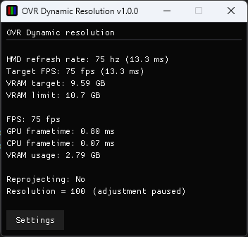

# OpenVR Dynamic Resolution

[](https://github.com/Erimelowo/OpenVR-Dynamic-Resolution/actions/workflows/vs17.yml)
[](https://github.com/Erimelowo/OpenVR-Dynamic-Resolution/actions/workflows/Ubuntu.yml)



Lightweight OpenVR app to dynamically adjust your HMD's resolution depending on your GPU frametime, CPU frametime and VRAM.

This allows you to always play at the maximum resolution your GPU can handle while hitting your target FPS (without reprojecting). This is especially useful for games in which performance varies a lot (e.g. VRChat).

This is **not** the same as SteamVR's Auto Resolution, which instead seems to be using a kind of benchmarking approach.

**Check out [WorkingGames.md](WorkingGames.md) for a list of working and non-working games.**

## Installation

**[Get OVRDR on Steam](https://store.steampowered.com/app/3243840/OVR_Dynamic_Resolution/)!**  

Manual installation:
- Download the [latest release ](https://github.com/Erimelowo/OpenVR-Dynamic-Resolution/releases/latest/download/OVR-Dynamic-Resolution.zip)
- Extract the .zip
- Launch `OVR-Dynamic-Resolution.exe`

## Building from source

We assume that you already have Git and CMake installed.
To set up the project, run:

```
git clone https://github.com/Erimelowo/OpenVR-Dynamic-Resolution.git
cd OpenVR-Dynamic-Resolution
cmake -B build
```

Then you can build the project in release mode by running:
```
cmake --build build --config Release
```

The newly built binary, its dependencies and resources will be in the `build/release` directory.  
Note: you can delete `imgui.lib` and `lodepng.lib` as they're just leftovers.

## Licensing

[BSD 3-Clause License](/LICENSE)

This work is based on [SlimeVR-Feeder-App](https://github.com/SlimeVR/SlimeVR-Feeder-App) which is licensed under the BSD 3-Clause License.  
We also use:  
- The [OpenVR](https://github.com/ValveSoftware/openvr) library which is also available under the BSD 3-Clause License.  
- [simpleini](https://github.com/brofield/simpleini) which is available the MIT License.  
- The [fmt](https://github.com/fmtlib/fmt) library which is available under a Boost-like license. 
- [DearImGui](https://github.com/ocornut/imgui) which is available under the MIT license.
- [lodepng](https://github.com/lvandeve/lodepng/blob/master/LICENSE) which is available under the zlib license.
- A [tray fork](https://github.com/dmikushin/tray) which is available under the MIT license.
