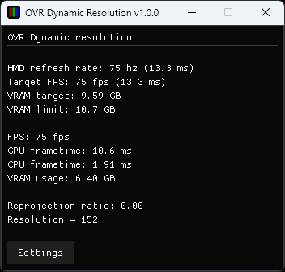

# OpenVR Dynamic Resolution

[](https://github.com/Erimelowo/OpenVR-Dynamic-Resolution/actions/workflows/vs17.yml)
[](https://github.com/Erimelowo/OpenVR-Dynamic-Resolution/actions/workflows/Ubuntu.yml)



Lightweight OpenVR app to dynamically adjust your HMD's resolution depending on your GPU frametime, CPU frametime and VRAM.

This allows you to always play at the maximum resolution your GPU can handle while hitting your target FPS (without reprojecting). This is especially useful for games in which performance varies a lot (e.g. VRChat).

This is **not** the same as SteamVR's Auto Resolution, which instead seems to be using a kind of benchmarking approach.

**Check out [WorkingGames.md](WorkingGames.md) for a list of working and non-working games.**

## Installation/Using It

- Download the [latest release ](https://github.com/Erimelowo/OpenVR-Dynamic-Resolution/releases/latest/download/OVR-Dynamic-Resolution.zip)
- Extract the .zip
- Launch `OVR-Dynamic-Resolution.exe`

## Settings Descriptions

Settings are found in the `settings.ini` file. Do not rename that file. It should be located in the same folder as the executable file (`OpenVR-Dynamic-Resolution.exe`).  
*Pro tip: if you want a higher resolution (for supersampling), you can lower your HMD's framerate or set `alwaysReproject` to 1 to increase the target frametime.*

- `autoStart`: (0 = disabled, 1 = enabled) Enabling it will launch the program with SteamVR automatically.

- `minimizeOnStart`: (0 = show, 1 = minimize, 2 = hide) Will automatically minimize or hide the window on launch.

- `initialRes`: The resolution the program sets your HMD's resolution when starting. Also the resolution that is targeted in vramOnlyMode.

- `minRes`: The minimum value the program will be allowed to set your HMD's resolution to.

- `maxRes`: The maximum value the program will be allowed to set your HMD's resolution to.

- `resChangeDelayMs`: The delay in milliseconds (1000ms = 1s) between each resolution change. Lowering it will make the resolution change more responsive, but will cause more stuttering from resolution changes.

- `resIncreaseMin`: How many static % to increase resolution when we have GPU and VRAM headroom.

- `resDecreaseMin`: How many static % to decrease resolution when GPU frametime or VRAM usage is too high.

- `resIncreaseScale`: How much to increase resolution depending on GPU frametime headroom.

- `resDecreaseScale`: How much to decrease resolution depending on GPU frametime excess.

- `resIncreaseThreshold`: Percentage of the target frametime at which the program will stop increase resolution

- `resDecreaseThreshold`: Percentage of the target frametime at which the program will stop decreasing resolution

- `dataAverageSamples`: Number of samples to use for the average GPU time. One frame gives one sample.

- `minCpuTimeThreshold`: Don't increase resolution when CPU time in milliseconds is below this value. Useful to avoid the resolution increasing in the SteamVR void or during loading screens. Also see resetOnThreshold.

- `resetOnThreshold`: (0 = disabled, 1 = enabled) Enabling will reset the resolution to initialRes whenever minCpuTimeThreshold is met. Useful if you wanna go from playing a supported game to an unsuported games without having to reset your resolution/the program/SteamVR.

- `ignoreCpuTime`: (0 = disabled, 1 = enabled) Don't use the CPU frametime to adjust resolution.

- `preferReprojection`: (0 = disabled, 1 = enabled) If enabled, the GPU target frametime will double as soon as the CPU frametime is over the target frametime; else, the CPU frametime needs to be 2 times greater than the target frametime for the GPU target frametime to double.

- `alwaysReproject`: (0 = disabled, 1 = enabled) Enabling will double the target frametime, so if you're at a target FPS of 120, it'll target 60. Useful if you have a bad CPU but good GPU.

- `vramTarget`: The target VRAM usage in percents. Once your VRAM usage exceeds this amount, the resolution will stop increasing.

- `vramLimit`: The maximum VRAM usage in percents. Once your VRAM usage exceeds this amount, the resolution will start decreasing.

- `vramMonitorEnabled`: (0 = disabled, 1 = enabled) If enabled, vram specific features will be enabled, otherwise it is assumed that free vram is always available.

- `vramOnlyMode`: (0 = disabled, 1 = enabled) Only adjust resolution based off VRAM; ignore GPU and CPU frametimes. Will always stay at initialRes or lower (if VRAM limit is reached).

- `disabledApps`: Space-delimited list of OpenVR application keys that should be ignored for resolution adjustment. Steam games use the format steam.app.APPID, e.g. steam.app.438100 for VRChat and steam.app.620980 for Beat Saber.

## Building from source

We assume that you already have Git and CMake installed.
To set up the project, run:

```
git clone https://github.com/Erimelowo/OpenVR-Dynamic-Resolution.git
cd OpenVR-Dynamic-Resolution
cmake -B build
```

Then you can build the project in release mode by running:
```
cmake --build build --config Release
```

The newly built binary, its dependencies and resources will be in the `build/release` directory.  
Note: you can delete `imgui.lib` and `lodepng.lib` as they're just leftovers.

## Licensing

[BSD 3-Clause License](/LICENSE)

This work is based on [SlimeVR-Feeder-App](https://github.com/SlimeVR/SlimeVR-Feeder-App) which is licensed under the BSD 3-Clause License.  
We also use:  
- The [OpenVR](https://github.com/ValveSoftware/openvr) library which is also available under the BSD 3-Clause License.  
- [simpleini](https://github.com/brofield/simpleini) which is available the MIT License.  
- The [fmt](https://github.com/fmtlib/fmt) library which is available under a Boost-like license. 
- [DearImGui](https://github.com/ocornut/imgui) which is available under the MIT license.
- [lodepng](https://github.com/lvandeve/lodepng/blob/master/LICENSE) which is available under the zlib license.
- [Traypp](https://github.com/Soundux/traypp) which is available under the MIT license.
